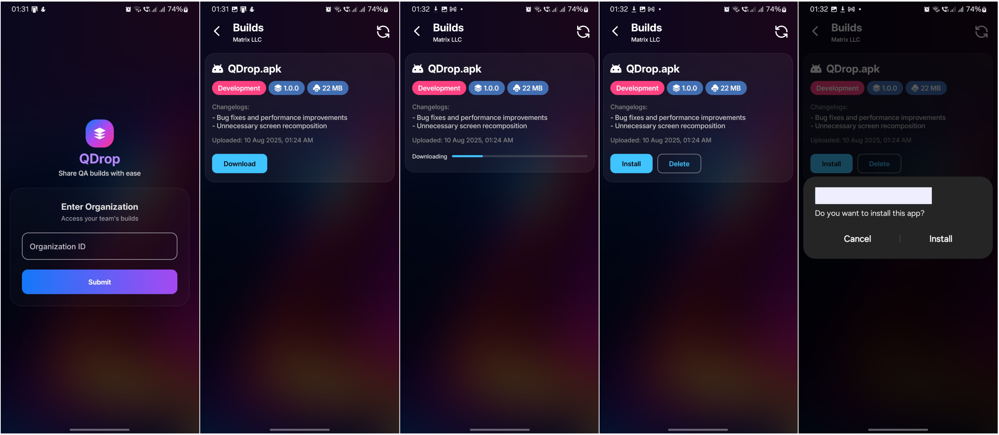

# QDrop – QA Build Distribution App

QDrop is an Android application built with **Jetpack Compose** for distributing QA (Quality Assurance) builds to testers.  
It uses:

- **Firebase Realtime Database** → Stores metadata for each build (name, version, download URL, etc.).  
- **Cloudflare R2 Storage** → Hosts APK files and provides public download links for testers.

---

## Introduction

The app fetches build metadata from Firebase and displays it in a clean UI for testers.  
When a tester selects a build, the app downloads the APK directly from Cloudflare and installs it.

---

## Screenshots

  

---

## Project Structure

```

app/
├── src/
│    ├── main/
│    │    ├── java/com/yourpackage/qdropapp/   # Kotlin source files (Jetpack Compose UI, ViewModels, etc.)
│    │    ├── res/                             # Resources (layouts, drawables, strings)
│    │    ├── AndroidManifest.xml
│    │    └── google-services.json             # Firebase config file (to be added by user)
├── build.gradle                              # Module-level Gradle build file
├── proguard-rules.pro                        # Optional, for release builds
build.gradle                                   # Project-level Gradle build file
gradle.properties                              # Gradle properties
settings.gradle                                # Gradle settings file
README.md                                      # This documentation file
.gitignore                                     # Files/folders ignored by Git

````

---

## What You Need to Change Before Running

1. **`google-services.json`**

    - This file contains your Firebase configuration.
    - A dummy example file (`google-services.example.json`) is provided for reference.
    - Download your own `google-services.json` from the Firebase Console and place it inside the `app/` directory.

2. **Firebase Realtime Database Rules**

    - Configure rules to allow only intended users to read/write.
    - Example (public read/write for testing only — **do not use in production**):

      ```json
      {
        "rules": {
          ".read": "true",
          ".write": "true"
        }
      }
      ```

3. **Cloudflare R2 Project Settings**

    - Create a bucket in Supabase Storage (e.g., `qdrop-apps`).
    - Enable public access if testers should download APKs without logging in.
    - Note your **Project URL** and **Public Anon Key** for uploading/downloading files.
    - Ensure APKs comply with allowed file types (`.apk`) and size limits.

---

## Firebase Setup

1. Visit [Firebase Console](https://console.firebase.google.com/).
2. Create a new project.
3. Enable **Realtime Database**.
4. Download the `google-services.json` file and add it to your `app/` folder.
5. Set security rules based on your needs.

---

## Cloudflare Setup

1. Visit Cloudflare
2. Create a new project.
3. Create a storage bucket for APK files.
4. Optionally make it public for direct download access.
---

## How to Get Started

### If you want to **use** the app without contributing:

```bash
git clone https://github.com/styropyr0/QDrop-App.git
cd QDrop-App
````

### If you plan to **contribute** or customize the app:

1. Fork the repository on GitHub: [https://github.com/styropyr0/QDrop-App](https://github.com/styropyr0/QDrop-App)

2. Clone your fork locally:

```bash
git clone https://github.com/YOUR_GITHUB_USERNAME/QDrop-App.git
cd QDrop-App
```

3. Add your Firebase `google-services.json` file inside the `app/` directory.

4. Configure Supabase credentials and permissions as described.

5. Open the project in Android Studio, then build and run.

---

## Running the App

1. Place your real `google-services.json` inside the `app/` directory.
2. Configure your Supabase bucket and permissions.
3. Open the project in Android Studio.
4. Build and run the app on your device or emulator.

---

## Security Notes

* Never commit your real `google-services.json` to public repos.
* Restrict Firebase and Cloudflare access rules appropriately in production.
* For open-source releases, provide example config files instead of real credentials.

---

## Example `google-services.json` (Dummy)

```json
{
  "project_info": {
    "project_number": "123456789012",
    "firebase_url": "https://your-project-id-default-rtdb.region.firebasedatabase.app",
    "project_id": "your-project-id",
    "storage_bucket": "your-project-id.appspot.com"
  },
  "client": [
    {
      "client_info": {
        "mobilesdk_app_id": "1:123456789012:android:abcdef1234567890",
        "android_client_info": {
          "package_name": "com.example.app"
        }
      },
      "oauth_client": [],
      "api_key": [
        {
          "current_key": "YOUR_FIREBASE_API_KEY"
        }
      ],
      "services": {
        "appinvite_service": {
          "other_platform_oauth_client": []
        }
      }
    }
  ],
  "configuration_version": "1"
}
```

---

## License

This project is licensed under the MIT License — see the [LICENSE](LICENSE) file for details.

```
